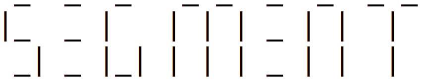

# Segment Library
[](https://GitHub.com/BlaT2512/Segment/releases/)
[](https://github.com/BlaT2512/Segment/blob/master/LICENSE)
[](https://GitHub.com/BlaT2512/Segment/issues/)
[](https://GitHub.com/BlaT2512/Segment/stargazers/)



Welcome to the Segment library! This is an Arduino library for 7/14/16 displays, wired up to the arduino using 7 wires (sega - segg), with a decimal point (sega - dp) or with a shift register (clock, latch and data).


# Installation
To install Segment, install it using the Arduino library manager, or manually from the [releases page](https://github.com/Blake-Tourneur/Segment/releases).

# Using the library / syntax
## Declare the library
You can either declare the library for use with straight wiring, straight wiring with a decimal point or with a shift register. You also specify whether you have a common cathode (one ground pin on the display and a positive pin for all the segments) or a common anode display (one positive pin on the display and a ground pin for all the segments). True is common cathode and False is common anode.

STRAIGHT WIRING:
```C++
#include <Segment.h>   // Include the Segment library
Segment sevseg(5, 6, 7, 8, 9, 10, 11, true);   // Set the pins you want and whether the display is common anode/cathode
//   Segments: a, b, c, d, e, f,  g,  c a/c
```
STRAIGHT WIRING WITH DECIMAL POINT:
```C++
#include <Segment.h>   // Include the Segment library
Segment sevseg(5, 6, 7, 8, 9, 10, 11, 12, true);   // Set the pins you want and whether the display is common anode/cathode
//   Segments: a, b, c, d, e, f,  g,  dp, c a/c
```
SHIFT REGISTER WIRING:
```C++
#include <Segment.h>   // Include the Segment library
Segment sevseg(5, 6, 7, true);   // Set the pins you want and whether the display is common anode/cathode
//       Pins: D, C, L, c a/c
```

#### SUPPORT FOR 16-segment, 14-segment and Virtual ASCII Art (Serial) DISPLAYS IS COMING SOON!

## Commands
### Printing characters
You can currently print to your seven segment display most possible English alphanumeric characters and symbols. It is possible to print: Numbers 0-9, Letters A-Z and Characters "#$%&'()*+,-~/\`:;<=>?[]{}.\\^_!

The format of the function is `sevseg.display(char charac)`.

Here are some examples of printing single characters:
```C++
  sevseg.display('A'); // Display letter A
  sevseg.display('5'); // Display number 5
  sevseg.display(';'); // Display character ;
  sevseg.display('G'); // Display letter G
  sevseg.display('3'); // Display number 3
  sevseg.display('!'); // Display character ! (only supported for display with decimal point)
```
### Printing strings
You can also print a string to the display(s), and it will print all the characters. By specifying the number of displays daisy-chained, it will automatically scroll the text if there is more characters in it than the number of displays. Also, you can specify whether to clear displays beforehand. If not and a word is shorter than the number of displays, there will be a letter from the previous word on unused displays.

The format of the function is `sevseg.displayString(String word, int displays = 1, bool cleardisp = true)`

Here are some examples of printing strings:
```C++
  sevseg.displayString("Hello"); // Display Hello on 1 display, and clear the display beforehand
  sevseg.displayString("Good bye", 4); // Display Good bye across 4 displays, and clear the displays beforehand
  sevseg.displayString("OK", 3, false); // Display OK on 3 displays, and don't clear the displays beforehand (since there are three displays and two characters, the 3rd one will have a letter from the previous text on it as it isn't cleared)
  sevseg.displayString("Awesome!", 5, true); // Display Awesome! on 5 displays, and clear the displays beforehand
```
### Clearing the display(s)
To clear the display(s), use `sevseg.clear(displays)`, where displays is the number of 7seg displays daisy-chained (integer). The command will clear them all. To just clear one display (or, if you have multiple, it will be like a space/gap), use `sevseg.display(' ')` or `sevseg.clear()`.
### Fun features
There is also the `sevseg.example(int mode, int delayTime, int semiMode = 0)` function which lets you display fun stuff e.g. figure-8, tetris-like display and scrolling through characters. The fun function is selected with the `mode` integer, which is a number from 1-6. `delayTime` is the delay between when the frame is updated. Mode (-)1 is a character scroll, and `semiMode` is used to select which characters to scroll through. `semiMode` is not used for any other mode. Here is the modes and descriptions of this function:
```
NOTE: Putting a negative sign before the mode reverses it. eg. mode -1 and semimode 1 scrolls from 9 to 0
The modes for the example function are:
1 - Scroll through characters. Semimodes are:
    1 - Just numbers
    2 - Just letters
    3 - Numbers & letters
    4 - Numbers & punctuation
    5 - Letters & punctuation
    6 - Numbers, letters and punctuation (everything)
2 - Animate 1 segment around the display (default clockwise unless negative sign is used)
3 - Animate 1 blank segment around the lit up display (default clockwise unless negative sign is used)
4 - Animate move upwards (negative numbers makes animate move downwards)
5 - Animate in an 8 fashion (negative number changes direction)
6 - Animate all segments on (a,b,c,d,e,f,g order) (negative number makes it animate all segments off)
```
The example `Examples.ino` demonstrates all of these functions. See below.

## Examples
The examples available for this library are:

`Number_Cycle.ino` - Cycles through the numbers 0-9 and then blank. Go to `File > Examples > Segment > Seven Segment > Number_Cycle`.

`Letter_Cycle.ino` - Cycles through the letters A-Z and then blank. Demonstrates use of 'for' loop. Go to `File > Examples > Segment > Seven Segment > Letter_Cycle`.

`Serial_Input.ino` - Prints the character/string on the display as recieved by Serial. Go to `File > Examples > Segment > Seven Segment > Serial_Input`.

`Examples.ino` - Demonstrates all of the functions available with the 'example' function. Go to `File > Examples > Segment > Seven Segment > Examples`.

# Updates
Updates can be done through the Arduino Library Manager, or by downloading the latest package from [releases page](https://github.com/BlaT2512/Segment/releases).
### Future update list (current version 2.6.0):
3.0.0 - Add support for 16-segment displays


3.1.0 - Add support for virtual ASCII art (Serial) displays
Here is a demonstration of the virtual ASCII 16-segment display that will be added:


3.2.0 - Add support for multiple instances of library to work, so you can use different wired displays (you can currently only use multiple displays if they are daisy chained)

3.3.0 - Add support for 14-segment displays

3.4.0 - Add support for dot matrix displays
### Possible updates
Add support for BCD (binary coded decimal) decoder wired displays

# License
This library is licensed under the `Apache 2.0` license. For more information, [click here](https://www.apache.org/licenses/LICENSE-2.0).
